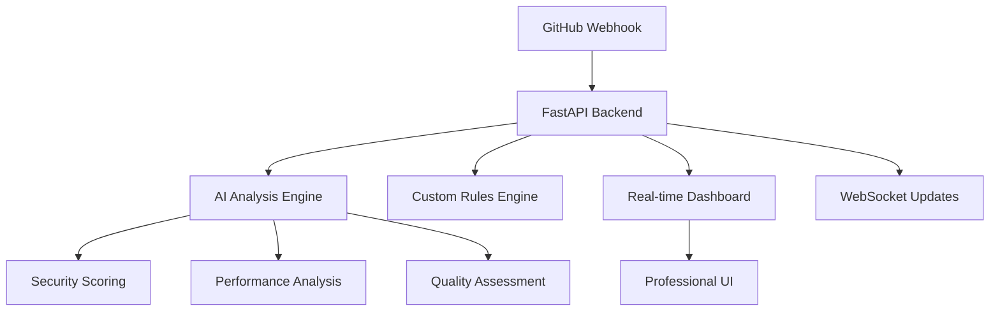

# 🤖 AI Code Review Platform

Enterprise-grade automated code review system powered by AI — real-time analysis, security scoring, and a professional dashboard interface.

---

## 🌟 Overview

An intelligent platform that automatically analyzes GitHub pull requests using advanced AI. Provides feedback on:

- Security vulnerabilities
- Performance optimizations
- Code quality & best practices

All through a real-time, elegant dashboard.

---

## ✨ Key Features

- 🔍 **Smart Line-by-Line Analysis** – AI posts feedback on exact problematic lines  
- 🛡️ **Advanced Security Scoring** – Detect vulnerabilities with risk assessment  
- ⚡ **Performance Metrics** – Suggests optimizations and complexity analysis  
- 📊 **Real-Time Dashboard** – Live metrics, scoring, and trend charts  
- 🔧 **Custom Rules Engine** – Configure team-specific coding standards  
- 🌐 **Multi-Language Support** – 11+ languages supported  
- 📈 **Export & Analytics** – CSV/JSON export with trend visualizations  
- 📱 **Mobile Responsive** – Professional UI across devices  

---

## 🚀 Demo

### 📺 Dashboard Interface  
*Add a screenshot here with: ``*

### 🧠 Smart Code Analysis

```python
def vulnerable_function(user_input):
    password = "admin123"  # 🚨 CRITICAL: Hardcoded password detected
    query = f"SELECT * FROM users WHERE name = '{user_input}'"  # 🔴 HIGH: SQL injection risk
    print(f"Query: {query}")  # 🟡 LOW: Remove console logs in production
    # TODO: Add input validation  # ℹ️ INFO: TODO comment tracked
```

**AI Review Output:**

- **Overall Score:** 45/100  
- **Security Score:** 20/100 (HIGH RISK)  
- **Performance Score:** 85/100  
- **Issues Found:** 1 Critical, 1 High, 1 Low, 1 Info  

---

## 🏗️ Architecture



---

## 📦 Installation

### Prerequisites

- Python 3.8+
- GitHub Personal Access Token
- OpenAI API Key (optional)

### Quick Start

```bash
git clone https://github.com/yourusername/ai-code-review-platform.git
cd ai-code-review-platform

python -m venv venv
source venv/bin/activate  # On Windows: venv\Scripts\activate

pip install -r requirements.txt

cp .env.example .env
# Edit .env with your API keys

python main.py
```

Visit: `http://localhost:8000/dashboard`

---

## 🔧 Configuration

### Environment Variables

Create a `.env` file:

```env
# GitHub Integration
GITHUB_TOKEN=ghp_your_github_token
GITHUB_WEBHOOK_SECRET=your_webhook_secret

# AI Enhancement
OPENAI_API_KEY=sk_your_openai_key

# Server Configuration
PORT=8000
HOST=0.0.0.0
```

### GitHub Webhook Setup

1. Go to **Repo → Settings → Webhooks**
2. Add Webhook:

```
Payload URL: https://your-domain.com/webhook
Content type: application/json
Secret: [Same as GITHUB_WEBHOOK_SECRET]
Events: Pull requests
```

---

## 🧩 Custom Rules Configuration

`rules_config.yml` example:

```yaml
custom_rules:
  - id: "no_hardcoded_secrets"
    name: "No Hardcoded Secrets"
    severity: "critical"
    pattern: "(password|api_key|secret)\s*=\s*['\"][^'\"]+['\"]"
    languages: ["python", "javascript", "java"]
    enabled: true
```

---

## 🎯 Usage

### Dashboard Navigation

- 📊 Overview – Metrics & charts  
- 📋 Reviews – History & export  
- 📈 Analytics – Performance trends  
- 🛡️ Security – Risk and scoring  
- ⚡ Activity – Live events  
- ⚙️ Settings – Configuration  

---

## 📡 API Endpoints

| Endpoint               | Method | Description                         |
|------------------------|--------|-------------------------------------|
| `/`                    | GET    | Service info                        |
| `/health`              | GET    | Health check                        |
| `/webhook`             | POST   | GitHub webhook receiver             |
| `/api/reviews`         | GET    | Review history                      |
| `/api/stats`           | GET    | Analytics and stats                 |
| `/api/export/reviews`  | GET    | Export reviews (CSV/JSON)          |
| `/api/rules`           | GET    | Custom rules summary                |
| `/ws`                  | WS     | WebSocket for real-time updates     |

---

## 🛡️ Security Analysis

### Detected Vulnerabilities

- SQL/Command Injection
- Hardcoded credentials
- Weak encryption
- XSS
- Insecure dependencies
- Misconfiguration

**Scoring Formula:**

```python
security_score = 100 - (critical * 25) - (high * 15) - (medium * 8)
```

---

## ⚡ Performance Analysis

### Tracked Metrics

- Cyclomatic complexity
- Inefficient loops & queries
- Memory usage
- Caching potential

### Suggestions

- Optimize loops  
- Tune queries  
- Reduce memory leaks  
- Add caching  

---

## 📊 Code Quality Assessment

- Maintainability: 0–100  
- Readability: 0–100  
- Test Coverage Estimate: 0–100  
- Documentation Score: 0–100  

---

## 🌍 Multi-Language Support

| Language   | Security | Performance | Style Guide       |
|------------|----------|-------------|-------------------|
| Python     | ✅ Bandit | ✅ Complexity | ✅ PEP 8         |
| JavaScript | ✅ XSS    | ✅ DOM        | ✅ ES6+          |
| TypeScript | ✅ Types  | ✅ Async      | ✅ TSLint        |
| Java       | ✅ Manager| ✅ JVM Opt    | ✅ Oracle         |
| C++        | ✅ Memory | ✅ STL        | ✅ Google Style   |
| Go         | ✅ Safe   | ✅ Concurrency| ✅ Effective Go   |
| Rust       | ✅ Safe   | ✅ Abstractions| ✅ Clippy        |
| PHP        | ✅ Web    | ✅ Perf       | ✅ PSR            |
| Ruby       | ✅ Rails  | ✅ Gems       | ✅ Style Guide    |
| Swift      | ✅ iOS    | ✅ Perf       | ✅ Swift Style    |
| Kotlin     | ✅ Android| ✅ Coroutines | ✅ Kotlin Guide   |

---

## 🧪 Development

### Project Structure

```
ai-code-review-platform/
├── main.py
├── dashboard.html
├── custom_rules.py
├── requirements.txt
├── .env.example
├── .gitignore
├── README.md
├── LICENSE
└── CONTRIBUTING.md
```

### Local Testing

```bash
python main.py
curl http://localhost:8000/health
black main.py custom_rules.py
```

---

## 🚀 Deployment

### Docker

```bash
docker build -t ai-code-review-platform .
docker run -p 8000:8000 --env-file .env ai-code-review-platform
```

### Cloud Options

- Railway (1-click deploy)  
- Render (auto deploy from GitHub)  
- Heroku (classic PaaS)  
- AWS/GCP/Azure (Docker/serverless)

---

## 📈 Metrics & Analytics

- Review volume  
- Code quality trends  
- Security posture  
- Language usage  
- Export: CSV, JSON, API  
- WebSocket for real-time notifications  

---

## 🤝 Contributing

```bash
git checkout -b feature/amazing-feature
# make changes
git commit -m "Add amazing feature"
git push origin feature/amazing-feature
```

Then, open a **Pull Request**. See [`CONTRIBUTING.md`](./CONTRIBUTING.md).

---

## 📝 License

This project is licensed under the [MIT License](./LICENSE)

---

## 🙏 Acknowledgments

- [FastAPI](https://fastapi.tiangolo.com/)  
- [OpenAI](https://openai.com/)  
- [GitHub](https://github.com/)  
- [Chart.js](https://www.chartjs.org/)  
- [Font Awesome](https://fontawesome.com/)

---

## 🔮 Roadmap

- Custom AI model training  
- IDE Extensions (VS Code, IntelliJ)  
- Slack/Discord Bots  
- Advanced security scanning (SAST/DAST)  
- Performance benchmarking  
- Team metrics and mobile app  

---

<div align="center">

Built with ❤️ for developers, by developers  
⭐ Star this repo | 🐛 [Report Bug](../../issues) | ✨ [Request Feature](../../discussions)

</div>

